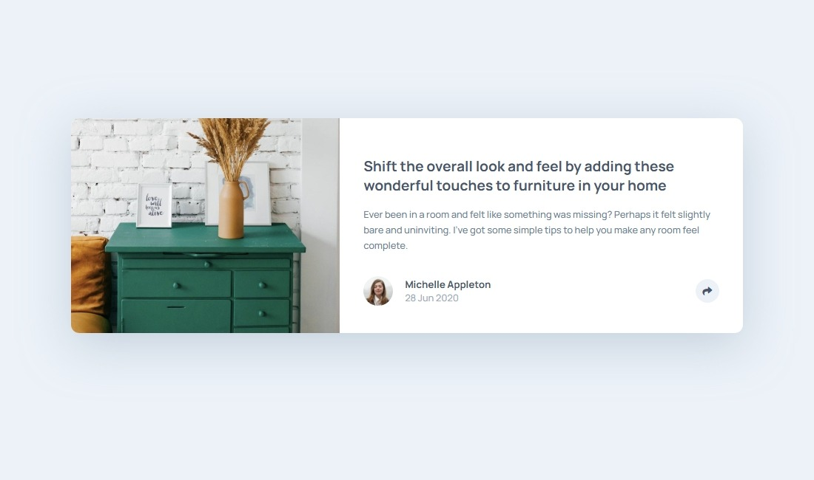

# Frontend Mentor - Article preview component solution

This is a solution to the [Article preview component challenge on Frontend Mentor](https://www.frontendmentor.io/challenges/article-preview-component-dYBN_pYFT). Frontend Mentor challenges help you improve your coding skills by building realistic projects. 

## Table of contents

- [Overview](#overview)
  - [The challenge](#the-challenge)
  - [Screenshot](#screenshot)
  - [Links](#links)
- [My process](#my-process)
  - [Built with](#built-with)
  - [What I learned](#what-i-learned)
  - [Useful resources](#useful-resources)

## Overview

### The challenge

Users should be able to:

- View the optimal layout depending on their device's screen size
- See hover states for interactive elements

### Screenshot
Here is a screenshot of the desktop solution:

--

Here is a screenshot of the desktop active solution:

Here is a screenshot of the mobile solution:

--

Here is a screenshot of the mobile active solution:

### Links

- Solution URL: [Frontend Mentor](https://www.frontendmentor.io/solutions/article-preview-component-B7FlYaYzP2)
- Live Site URL: [Vercel.com](https://article-preview-component-ochre.vercel.app/)

## My process

### Built with

- Semantic HTML5 markup
- CSS custom properties
- BEM
- Flexbox
- CSS Grid
- Mobile-first workflow
- Sass 
- JavaScript

### What I learned

- The `defer` attribute allows a JavaScript file to load in parallel with the HTML but ensures it executes only after the document has been fully parsed, preventing errors from accessing elements that aren’t yet available.

- That `querySelector` is more flexible, letting you select elements using any CSS selector (id, class, tag, attribute, etc.) instead of being limited to only ids or classes.

- `toggle()` adds a class to an element if it’s not already there, and removes it if it is — like switching the class on and off.

- `window.innerWidth` returns the interior width of the browser’s viewport in pixels, useful for adjusting a page’s behavior or style based on screen size.

### Useful resources

- [ChatGPT (OpenAI)](https://chatgpt.com/) - This helped me understand how different CSS properties work together, especially layout behavior and default styles. I used it as a coding assistant whenever I had a doubt.
- [Abdelrahman Gamal](https://nouvil.net/) - His tutorials are super beginner-friendly and helped me understand the basics of HTML, CSS and JavaScript. I really appreciated his clear explanations and structured approach to learning front-end development.
- [W3Schools](https://www.w3schools.com) - I used this site a lot to review syntax, explore new CSS properties, and test small snippets of code. It's really helpful for quick references and hands-on practice while learning.